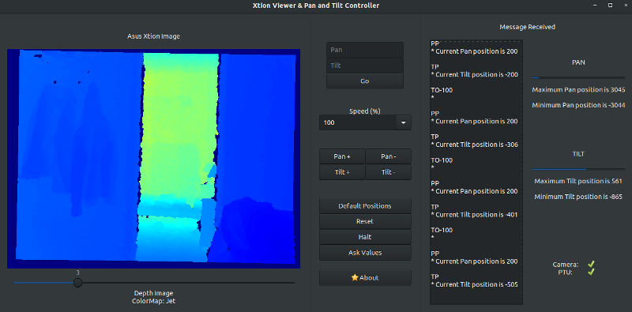
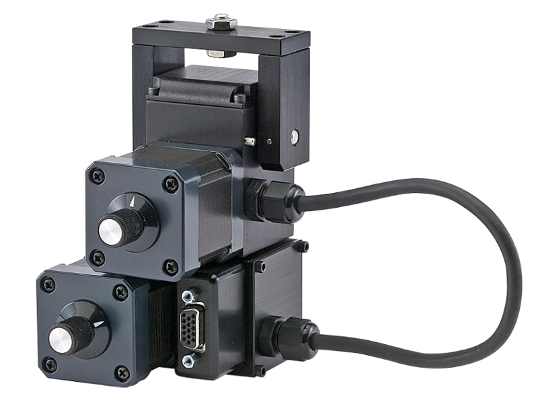

# PanTilt_AsusXTION
Project done that accomplishes the movement of a Pan and Titl Unit and Implementation of OpenNI2 for visualization of color and depth images from an Asus XTION 

## Description

[Presentation](./doc/PRESENTATION.pdf)

# Build Intructions

```
mkdir build

cd build/

cmake ..

make
```

If something doens't work, instead run ```make doc``` to build helpful documentation.

# Images

## UI



## Hardware



